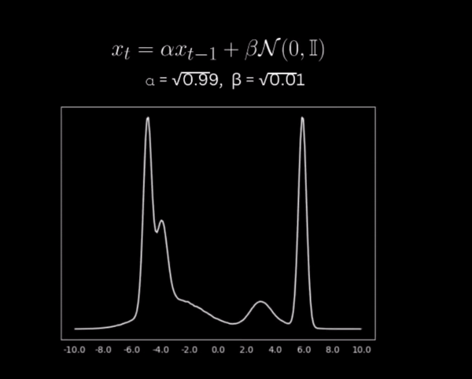

# 2DseisvelGenerator
Author : Ankur Kumar   
This is a generative model that will generate the random  samples of high quality seismic velocity models of earth's subsurface. This is a good application of **Generative AI** in the field of Geoscience.

 *Figure 1: Wang, Fu, Huang, Xinquan, and Alkhalifah, Tariq*   

Go to my [Hugging Face](https://huggingface.co/kankur0007/2DseisvelGenerator) profile and learn how  you can generate high quality random samples of  seismic velocity models with few lines of code. You can aslo see my [Spaces](https://huggingface.co/spaces/kankur0007/2DseisvelGenerator) in Hugging Face Community. You can see more details about this generative model in **2DseisvelGenerator's model card**. So well , this is a quick introduction of my repositories. Now I am going to tell you that **"What are the fundamental principles working behined this model and why i choose this !** 🤗. So let's start

## 📃 A Brief Introduction to Seismic FWI and It's Challenges 🙇🏻
Seismic Full Waveform Inversion (FWI) is a sophisticated geophysical technique designed to produce high-resolution subsurface models by aligning observed seismic data with synthetic data generated from a predictive model. It involves iteratively updating a model of the Earth's properties (such as velocity, density, etc) until the synthetic waveforms match the observed ones. Unlike conventional inversion methods, which often rely on specific portions of seismic data like travel times or amplitude, FWI utilizes the entire seismic waveform, incorporating both amplitude and phase information. This comprehensive approach results in far more detailed subsurface models.There are two methods of approaching the seismic full waveform inversion problem first one is **traditional method** approach and another one is **data driven** approach. In traditional inversion approach FWI is difficult due to its **ill-posedness**, **nonlinearity**, **limited resolution** , **computational complexity** and **time-consuming nature**  [Learn More](https://www.redalyc.org/journal/465/46558134008/html/) [2]. In this approach our model may get stuck in **local minima**, results poor convergence.These complexities make FWI extreme difficult and time-intensive to solve. In contrast, **data-driven** approaches provide a powerful alternative to traditional FWI by leveraging deep learning to handle nonlinearity, reduce computational costs and enhance the resolution. Various neural network architectures have been explored, but challenges remain in generalizing to different source functions and ensuring robustness against noise and missing data.
#### What are those challenges ? Let's see an example 🌝 :
Our traditional neural networks and most standard machine learning models are based on the assumption that the data used for training and testing are independent and identically distributed (i.i.d.)[3]. Here independent means each data point is independent of the others and identically distributed means all data points are drawn from the same probability distribution. The i.i.d. assumption does not hold in many real-world scenarios due to unforeseen distributional shift , leading to challenges in OOD generalization[3].Full Waveform Inversion (FWI) faces significant challenges in generalizing to out-of-distribution (OOD) data, where the test data distribution differs from the training data distribution , causing degradation in models performance[3].This is just one example of the many challenges we face when trying to generalize Neural Networks for seismic Full Waveform Inversion (FWI) problems, we will see these latter.

#### 💁🏻‍♂️ Practical Solutions for Challenges in Data-Driven FWI : 
We can solve these problem by two common approach 
- **Build a large, diverse, and realistic dataset** : By applying data augmentation, macking data more diverse and random ...etc.
- **Build a network with strong generalization ability** : By applying Transfer Learning and Pretraining, Hybrid Models,Regularization and Physics Constraints,....etc  
In this article, I will only discuss the issues associated with synthetic data and explore strategies for making the data more diverse and random so that we can improve our model's performence.

## Waveforms Gone Wild: 🤖 AI-Powered Velocity Models to Improve Seismic FWI 
Recently, neural networks and deep learning techniques have become popular in FWI, enhancing its capability to solve complex inverse problems.Neural networks used in Full Waveform Inversion (FWI) are typically trained on synthetic data due to the limited availability of large-scale real-world datasets. This scarcity stems from the high costs of acquiring and labeling seismic data, along with intellectual property and security concerns. Conducting seismic surveys in the field is both time-intensive and costly, requiring substantial resources for sensor deployment, data collection, and processing. Additionally, access to proprietary datasets from industry or government sources is often restricted, and there may be insufficient data from specific regions. When real seismic data is available, it is often limited in quantity and lacks the diversity needed to represent a wide range of geological conditions. Synthetic data offers a solution to this challenge, providing an endless supply of data that can be tailored to the specific needs of the neural network model. **But there may be a problem ,synthetic data can be cursed with bias**, and various types of statistical biases can emerge in the generation and usage of synthetic data. These biases often result from assumptions, simplifications, or limitations in the data generation process. The biases can influence the performance of deep learning models, leading to  incorrect results when applied to real-world data. Here are some common types of statistical bias that can occur in synthetic data
##### 1. Selection Bias
This occurs when the generated synthetic data does not accurately represent the diversity of real-world data. It happens when certain scenarios, geological structures, or subsurface conditions are overrepresented or underrepresented in the synthetic dataset.  Selection bias can lead to models that perform well on the synthetic data but poorly on real-world data, as they may fail to generalize to unseen or underrepresented conditions.

##### 2. Simulated Data Bias
Synthetic data is typically generated based on predefined parameters (e.g., velocity, density, geological structures). If these parameters are chosen arbitrarily or without sufficient variation, the synthetic data may not cover the full spectrum of real-world scenarios.  Simulated data bias can cause models to learn patterns that are too specific to the synthetic environment, resulting in poor performance when exposed to more varied real-world data.

#### 3. Confirmation Bias 
This occurs when the synthetic data is generated in a way that confirms pre-existing hypotheses or assumptions about the subsurface structures. The data generation process may be unintentionally guided by the researchers' expectations, leading to datasets that align with their beliefs rather than objective reality.

#### 4. Sampling Bias 
Synthetic data is often generated through sampling predefined distributions (e.g., velocity values, wave frequencies). If the sampling process is biased—favoring certain ranges or distributions—the generated data will not represent the true variability in real seismic conditions.

#### 5. Noise Bias 
The noise added to synthetic data is often simplified or idealized compared to real seismic noise, which can be complex, correlated, and non-stationary. If the synthetic noise does not accurately represent the types of noise present in real data, it introduces a bias.  
So well , these are the some common statistical bias that may occure while during generation of synthetic data. [Learn more about bias](https://link.springer.com/article/10.1007/s11831-024-10134-2
). **Now the question arises "can we remove these inherent bias from dataset?", and the answer is No!**. But we can improve it to some extent, how?

### 💡 Idea : 
**This idea is an experimental approach, and its effectiveness remains uncertain at this stage.** 
By diversifying  the dataset we can reduce bias from it to some extent. What i did , i took the 5000 random samples of each class (total 10 classes are present) from [Open FWI dataset](https://openfwi-lanl.github.io/docs/data.html)  and shuffled it randomly. After that i applied strong data augmentation like Flipping (Horizontal/Vertical), Rotation, Scaling, Cropping and Elastic Distortion to make my dataset more random and diverse. But still we have limited ammount of dataset and Hybrid Models like ***CNN-Transformer Fused Model*** needs large ammount of dataset to train.    
Now what i want, to train a deep learning model that took the finite number of samples what i have and learns their distribution. After that we can generate infinite number of samples from that learned distribution. ***Generative models*** does this task very well. Before moving forward you must have clear idea about what are [Generative and Discriminative Models](https://www.baeldung.com/cs/ml-generative-vs-discriminative) and how [Deep Generative Models](https://youtu.be/Dmm4UG-6jxA?si=EiP7DCs6mjSb_3Pj) works.

### 🧸 Generative Models
Generative models try to capture the distribution of the training data, enabling them to generate new data samples from this learned distribution. There are so many types of diffusion models like GANs , VAE , Diffusion Model ,Markov Chain Models ... etc. 

***Now for my task i am going to choose diffusion model, because this model has  shown exceptional performance in generating high-quality, diverse, and detailed images. Diffusion models provide better coverage of the data distribution compared to GANs and tend to produce more realistic outputs, especially in complex domains like natural images or seismic velocity models. [For evidence read this article](https://ar5iv.labs.arxiv.org/html/2105.05233). In this task I'll do the unconditional sampling of diffusion model to generate diverse velocity models that contains different types of geological structures.***

# Diffusion Models : 
***Diffusion models are inspired by non-equilibrium thermodynamics.*** They define a Markov chain of diffusion steps to slowly add random noise to data and then learn to reverse the ***diffusion process*** to construct desired data samples from the noise. Unlike VAE or flow models, diffusion models are learned with a fixed procedure and the latent variable has high dimensionality (same as the original data).
#### What is diffusion process ? 
A diffusion process is a type of stochastic process that models the continuous random movement of particles, prices, or other variables over time that follows the following characteristics
- **Continuous Path** : The process evolves continuously over time, with no sudden jumps.
- **Markov Property** : The future state of the process  $X_t$ depends only on its current state $X_{t-1}$ , not on the history of how it got there.

$$
\ P(X_t| X_{t-1},X_{t-2}.......X_{t-n}) = P(X_t | X_{t-1})
$$

- **Gaussian Increments**: The changes (increments) in the process over any small time interval are normally distributed with mean proportional to the time interval and variance proportional to both the time interval and a constant known as the diffusion coefficient. 

The diffusion process $X_t$ an often be described by a stochastic differential equation (SDE) of the form: 

$$
\ dX(t) = \mu (X(t),t)dt + \sigma (X(t),t)dW(t)
$$

**A diffusion processes follows principles of Markov chains and stochastic processes , how? w'll see at the end of this article , first w'll see how diffusion process works!**

## Denoising Diffusion Probabilistic Models(DDPM)
[Denoising Diffusion Probabilistic Models](https://arxiv.org/pdf/2006.11239) are a class of generative models that learn to model the distribution of data by gradually transforming a simple distribution (like Gaussian noise) into a complex data distribution. This transformation is done through a sequence of incremental denoising steps like forward diffusion , reverse diffusion and sampling.

#### Forward Diffusion Process 

- The forward process involves adding noise to the data in small increments over a series of time steps. Starting with a data point $x_ 0$ from a real distribution  q(x) where  noise is gradually added to produce increasingly noisy versions $x_1,x_2......x_T$ where T is the total number of steps.
- By the final step, $x_T$ is pure Gaussian Noise. As T tends to infinite q(x) tend to isotropic gaussian. Now let's see how it mathematically works  

Now let's start macking our imput image gaussian by adding gaussian noise . Suppose we have a constant a , here we say image and we do a linear transformation

$$
\ a + bN(0,1) = N(a,b^2)
$$

I will use this fundamental principle to macking my image pure gaussian .  
So well , our transition function in DDPM model can be defined as 

$$
\ x_t = \alpha x_{t-1} + \beta N(0,I)
$$

where $\alpha$ and $\beta$ are noise scheduler which controles how much noise we have to add in my origional image. In first example we try with random value of 
$\alpha$ = 1.1 and $\beta$ = 0.1 . Heere these two constants are independent to each other. Here independent or uncorrelated constant values results in gradually transition in each step and changes  our distribution into normal very fast but we  want smooth transition in each step  and slow convergence into normal   , why w'll see in just a seconds.

Researchers found that setting $\alpha$ = $\sqrt{\alpha}$ and $\beta$ = $\sqrt{1-\alpha}$ satisfies the above condition as shown in simulation . So now our trasition function becomes $x_t = \sqrt{\alpha} x_{t-1} + \sqrt{1-\alpha} N(0,I)$  

Mathematically, the forward process is defined as: 

$$
q(x_t|x_{t-1}) = N(x_t ; \sqrt{\alpha_t}x_{t-1},\sqrt{(1-\alpha_t)}I)
$$

We can write this in terms of $x_t$:

$$
x_t = \sqrt{\alpha_t}x_{t-1} + \sqrt{1-\alpha_t}N(0,I)
$$

We can write this in terms of the original data $x_0$:

$$
x_t = \sqrt{\alpha_t}(\sqrt{1-\alpha_t}x_{t-2} + \sqrt{1-\alpha_t}N(0,I)) + \sqrt{1-\alpha_t}N(0,I)
$$

Finally, we can write:

$$
x_t = \sqrt{\bar{\alpha_t}}x_{0} + \sqrt{1-\bar{\alpha_t}}N(0,I)
$$

 

 So 
 

 $$
 q(x_t|x_0) =   N(x_t ; \sqrt{\bar{\alpha}_t} x_0, \sqrt{(1-\bar{\alpha}_t)}I)
 $$

where $\bar{\alpha_t} = \prod_{t=1}^T \alpha_i$ ,  
- $\alpha_t$ : is a variance schedule that controls how much noise is added at each step.
- N : denotes a Gaussian distribution.  

**Can we go into reverse direction ?**  

- The goal of a diffusion model is to learn the reverse denoising process to iteratively undo the forward process.
- In this way, the reverse process appears as if it is generating new data from random noise!

**But finding the exact distribution is hard , why ?**

since we are given that $q(x_t|x_{t-1})$ from forward process , how do we compute $q(x_{t-1}|x_t)$ ? from bayes theorem we know that 

$$
q(x_{t-1}|x_t) = \frac{q(x_t|x_{t-1})q(x_{t-1})}{q(x_t)}
$$

$$
q(x_t) = \int q(x_t|x_{t-1})q(x_{t-1})dx
$$

**This is computationally intractable** 
- Need to integrate over the whole data distribution to find $q(x_t)$ and $q(x_{t-1})$
- Where else have we seen this dilemma ?
- We still need the posterior distribution to carry out the reverse process. Can we approximate it somehow --Yes!

### Reverse Diffusion Process:

If we can reverse the above process and sample from $q(x_{t-1}|x_t)$ we will be able to recreate the true sample from a Gaussian noise input, $x_t-- N(0,I)$. Note that if $\alpha_t$ is small enough $q(x_{t-1}|x_t)$ will also be Gaussian. Unfortunately, we cannot easily estimate $q(x_{t-1}|x_t)$ because it needs to use the entire dataset and therefore we need to learn a model $p_{\theta}$ to approximate these conditional probabilities in order to run the reverse diffusion process.So we choose our noise schedule such that the **forward process steps are very small (That's why we choosed our constants such that transition should be smooth).** Thus, we can approximate the reverse posterior distributions as Gaussians and learn their parameters (i.e., the mean and variance) via neural networks!

$$
\ p_{\theta}(x_0:t) = p(x_t) \prod_{t=1}^T p(x_{t-1}|x_t)
$$

where 

$$
\ p(x_{t-1}|x_t ) = N(x_{t-1},\mu_{\theta}(x_t,t) , \Sigma_{\theta}(x_t,t))
$$

### Training Objective : 
The model is trained to minimize the difference between the true reverse distribution $q(x_{t-1}|x_t)$ and and the learned reverse distribution $p_{\theta}(x_{t-1}|x_t)$ i.e minimize the KL Divergence.But Instead of doing this we minimise the squared error between the actual noise added during the forward process and the model predicted noise!. 

$$
\ L = E_{x_0,\epsilon}[||\epsilon - \epsilon_{\theta}(\sqrt{\bar{\alpha}}x_0) + \sqrt{1-\bar{\alpha}}\epsilon , t)||_2^2]
$$

### Unconditional Sampling :
Unconditional sampling in a Diffusion Probabilistic Model (DDPM) refers to the process of generating new data samples directly from the learned data distribution without conditioning on any specific input, such as labels or initial conditions. Given a trained diffusion model, unconditional sampling involves reversing the noise process by progressively denoising a randomly sampled Gaussian noise vector through a series of learned denoising steps.Given the reverse diffusion process in DDPM, starting from the Gaussian noise sample $x_T - N(0,I)$. we iteratively denoise through each time step t from T to 1.

$$
x_{t-1} = \frac{1}{\sqrt{\alpha_t}}(x_t - \frac{1-\alpha_t}{\sqrt{1-\bar{\alpha_t}}}\epsilon_{\theta}(x_t,t)) + \sigma_t z_t
$$

Where :
- $x_t$ : The sample at time step t.
- $\alpha_t$ : Controls the variance of the noise added during each time step in the forward diffusion process.
- $\bar{\alpha_t}$ = $\prod_{t=1}^T \alpha_t$
- $\epsilon_{\theta}(x_t,t)$ : The neural network's prediction of the noise component added at time step t, trained during the forward process.
- $\sigma_t$ : The noise scale for time step t, which is typically related to the variance schedule.
- $z_t$ : A noise term, typically drawn from a standard normal distribution $z_t - N(0,I)$.

### Diffusion in Latent Space and it's Architecture :
Latent Diffusion Models (LDMs) are an evolution of traditional diffusion models, designed to overcome the significant computational challenges associated with generating high-resolution images directly in pixel space. Traditional diffusion models require processing each pixel individually, which becomes computationally expensive and slow, particularly for large images. LDMs address this issue by operating in a lower-dimensional latent space, which is a compressed representation of the image learned by an autoencoder or a Variational Autoencoder (VAE). By applying the diffusion process in this latent space, LDMs reduce the dimensionality of the data, making the generative process much more efficient while still preserving the essential features of the original images. After the diffusion process in the latent space, the model decodes the compressed representation back into a high-resolution image, ensuring that the final output remains detailed and high-quality. This efficiency makes LDMs particularly well-suited for tasks like high-resolution image generation, text-to-image synthesis, and other applications that require both high image fidelity and scalability. LDMs strike a balance between computational efficiency and image quality, making them a powerful tool in the field of generative modeling.

#### Working of U-Net in DDPM 
The reverse diffusion process is designed to reverse the forward noising process. Using a learned model, we aim to reconstruct the original image from the final noisy image by progressively removing noise. A U-Net architecture is commonly used for this task. It consists of an encoder-decoder structure with skip connections that allow the model to leverage both high-level and low-level features. At each timestep t of the reverse process, the noisy image $x_t$ and the corresponding timestep 𝑡 are fed into the U-Net model. The U-Net is trained to predict the noise that was added at timestep t which is denoted as $\bar{\epsilon}_t$ . The U-Net outputs a prediction of the noise $\bar{\epsilon}_t$ . This prediction is used to estimate the clean image from the noisy one. The predicted noise is subtracted from the noisy image to get less noisy image.

$$
x_{t-1} = \frac{1}{\sqrt{\alpha_t}}(x_t - \frac{1-\alpha_t}{\sqrt{1-\bar{\alpha_t}}}\epsilon_{\theta}(x_t,t)) + \sigma_t z_t
$$

​This equation essentially removes the predicted noise, bringing the image closer to the original state.This process is repeated iteratively, moving backwards from the final noisy image $x_T$ towards the clean image $x_0$. At each step, the U-Net refines its prediction, progressively reducing the noise until the image closely resembles the original.

 

 ## Why Diffusion Process is Markov chains and Stochastic processes : 
 The forward process corrupts data, while the reverse process restores it, but they operate under the same mathematical principles of state evolution via Markovian and stochastic transitions.

 ### Markov Chain for Both Processes : 
 In both the forward and reverse processes, the evolution of states follows a Markov chain, which is defined by the following property:

 $$
\ P(X_t| X_{t-1},X_{t-2}.......X_{t-n}) = P(X_t | X_{t-1})
$$

This means that the next state $x_t$ (in the forward process) or the previous state $x_{t-1}$ (in the reverse process) depends only on the immediately preceding state and not on any states before that.

##### In Forward Process : 
$x_t$  is depend only on $x_{t-1}$ where noise is added progressively. The state at each time step depends only on the state from the previous step.

$$
q(x_t|x_{t-1}) = N(x_t ; \sqrt{\alpha_t}x_{t-1},\sqrt{(1-\alpha_t)}I)
$$

#### In Reverse Process : 
$x_{t-1}$ is depend only on $x_t$ where noise is removed progressively. The model estimates the mean and covariance for the denoising step.

$$
\ p(x_{t-1}|x_t ) = N(x_{t-1}; \mu_{\theta}(x_t,t) , \Sigma_{\theta}(x_t,t))
$$

###  Stochastic Process for Both Processes :
Both the forward and reverse diffusion processes are stochastic processes, meaning that randomness is involved at each step. In these processes, each transition involves sampling from a probability distribution, typically a Gaussian distribution.

#### In Forward Process : 
Random noise 𝜖 is added to the data at each step, making the progression from clean data to noisy data inherently random.

$$
x_t = \sqrt{\alpha_t}x_{t-1} + \sqrt{1-\alpha_t}𝜖
$$

 where 𝜖 ~ N(0,I)

 #### In Reverse Process : 
 At each step, noise is removed by sampling from a learned distribution. The removal process is not deterministic but involves drawing from a Gaussian distribution predicted by the model.

$$
x_{t-1} -- p(x_{t-1}|x_t ) = N(x_{t-1}; \mu_{\theta}(x_t,t) , \Sigma_{\theta}(x_t,t))
$$
 
 

 So it is all about my work . If you want to learn more about DDPM and Diffusion Models [Click Here](https://arxiv.org/html/2312.10393v1).

### Acknowledgments : 
- [1] ***Deep Learning for Visual Data , University of California, Berkeley.***  
- [2] . Zhu, M., Feng, S., Lin, Y., Lu, L., 2023. Fourier-DeepONet: Fourier-enhanced deep 
operator networks for full waveform inversion with improved accuracy, generalizability, and 
robustness.
- [3] . Liu, J., Shen, Z., He, Y., Zhang, X., Xu, R., Yu, H., Cui, P., 2023. ***Towards Out-Of-Distribution 
Generalization: A Survey***

